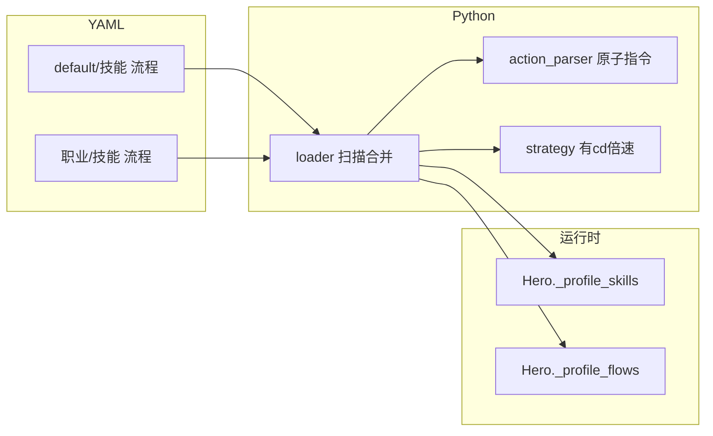

# 战斗配招系统（YAML Profile）维护说明

本文档整理自多轮设计与实现对话，供后续维护、排障与扩展职业时查阅。

---

## 1. 背景与目标

### 1.1 项目现状（改造前）

- 战斗连招写在 [`ZmxyOL/battle/skill/skills.py`](../../ZmxyOL/battle/skill/skills.py) 中，全局单例 `h`，`travel` / `battle` / `battle_loop` 等为硬编码。
- 账号多角色（`active_character` 等）与战斗配招无绑定；无「职业」维度。

### 1.2 参考项目（ZenlessZoneZero-OneDragon）

- 多代理人：`AgentEnum` 注册 + 编队 + CV/模板识别 + 条件状态机。
- 战斗：`ConditionalOperator` + YAML（`auto_battle` / `state_handler` / `operation`）三层拼装；所谓「battle loop」≈ 无 `triggers` 的主 `Scene`。
- 与本项目差异：绝区零方案更重识别与引擎；本项目侧重 **移动端点击序列 + 轻量 YAML**，不要求复刻其全部复杂度。

### 1.3 本系统目标

- **三层积木**：底层原子指令 → 中层可引用组件 → 上层流程（策略、轮替、触发器）。
- **多职业**：`default/` 为全局回退；`{职业名}/` 覆盖同名定义。
- **性能**：登录或首次需要时 **预编译** YAML，运行时仅为函数调用，避免反复读盘与解析。
- **用户文档**：面向玩家的说明放在资源目录 [`ZmxyOL/assets/profiles/配招教程.md`](../../ZmxyOL/assets/profiles/配招教程.md)（不写 Python/YAML 术语）。

---

## 2. 目录与资源位置

配招根目录（随仓库发布，属 assets 一部分）：

```
ZmxyOL/assets/profiles/
  default/
    技能/          # 通用组件 + 默认战斗/赶路（全职业回退）
    流程/          # 战斗循环、竞技场等
  {职业名}/        # 例：琉离/
    技能/
    流程/
  配招教程.md      # 玩家向教程
```

加载器路径见 [`ZmxyOL/battle/skill/loader.py`](../../ZmxyOL/battle/skill/loader.py) 中 `PROFILES_DIR`（指向 `ZmxyOL/assets/profiles`）。

---

## 3. 架构概要



- **加载顺序**：先读 `default/技能`、`default/流程`，再读 `{职业}/技能`、`{职业}/流程`；**同名 key 后者覆盖前者**。
- **引用**：技能列表中可写原子指令，或写已定义的组件名（跨文件合并后的顶层名称）。

---

## 4. 底层原子指令（实现约定）

实现见 [`ZmxyOL/battle/skill/action_parser.py`](../../ZmxyOL/battle/skill/action_parser.py)。

统一书写格式：`动作名` 或 `动作名:参数`（参数与动作名之间**一个英文冒号**，技能列表里**冒号后不加空格**，避免被解析成 YAML 嵌套结构）。

| 类别 | 约定 |
|------|------|
| 技能 | `技能1`～`技能6`；`技能N:秒` 为长按 N 秒 |
| 移动 | `左移`/`右移` 为轻点；`左移:距离`/`右移:距离` 为滑步（实现上为 **direct 滑步**，与旧版「无 direct」默认不同） |
| 跳跃 | `跳跃` / `跳跃:次数` |
| 等待 | `等待:秒` |
| 道具 | `法宝1`、`法宝2`、`无双`；`:秒` 为长按 |
| 其它 | `化身`（`化身:次数` 为连点次数）、`真武`/`本命神`、`合体`、`攻击` |

**设计说明（对话中已定稿）**

- 不再在底层暴露「带攻击+无双前摇的滑步」与「直接滑步」两套 API；**带前摇的位移**用中层组件（如 `无双左移` / `无双右移`）在 YAML 里用 `攻击`、`无双`、`等待`、滑步组合。
- 原 `法宝`/`仙宝` 在配招中改为 **`法宝1` / `法宝2`** 命名。
- `way_to_exit` 在技能层更名为 **`离开关卡`**，并保留 `way_to_exit` 别名注册以兼容旧任务代码。

---

## 5. 流程 YAML 关键字段

流程由 `loader` 编译为字典，见 [`ZmxyOL/battle/skill/loader.py`](../../ZmxyOL/battle/skill/loader.py)。

- **`策略`**：按策略名（如 `战斗`、`赶路`）配置 `有cd` / `无cd`；`有cd` 下可按 `1倍速`、`3倍速` 等映射到技能组件名。解析见 [`strategy.py`](../../ZmxyOL/battle/skill/strategy.py)（未配置的倍速会选最接近的一档）。
- **`初始`**：进入循环前执行一次的动作列表。
- **`轮替`**：`策略名:权重`，如 `战斗:2`、`赶路:1`。
- **`触发器`**：结构化块，**注意 `每:` 与数字之间必须有空格**（例：`每: 60`），否则 YAML 解析会失败或与 `执行:` 冲突。
- **`超时`**：秒。

---

## 6. Python 侧要点

### 6.1 Hero（[`hero.py`](../../ZmxyOL/battle/character/hero.py)）

- `Hero._class_skills`：`@combo` 注册的入口（如 `battle_loop`、`travel`、`离开关卡`）。
- `Hero._profile_skills`：YAML 编译出的组件，**同名时优先于类级技能**（通过 `__getattribute__`）。
- `load_profile(profession)`：加载指定职业目录 + default。
- **`_ensure_profile()`**：若尚未加载任何流程（`_profile_flows` 为空），**自动 `load_profile('default')`**，避免任务未显式登录时调用 `battle_loop` 报错。

### 6.2 skills（[`skills.py`](../../ZmxyOL/battle/skill/skills.py)）

- `travel` / `battle`：先 `_ensure_profile()`，再按当前 `has_cd`、`speed_x` 从流程里名为 `战斗`/`赶路` 的策略解析组件并执行；解析失败则走简单兜底序列。
- `battle_loop`：先 `_ensure_profile()`，再按 YAML 流程执行；支持 `flow_name`、`battle_weight`、`max_duration` 等覆盖。
- `jjc_battle`：优先 `竞技场循环` 流程。

### 6.3 未登录时自动 default

历史上曾出现：`RuntimeError: 流程 '战斗循环' 未找到，请检查 profile 是否已加载`。  
**修复**：`_ensure_profile()` + 保证 `default` 下流程与技能 **自洽**（见下节）。

---

## 7. 运维与排障

### 7.1 default 必须包含「战斗/赶路」组件

**现象**：日志显示 `battle_loop` 已启动、`化身` 已点，之后循环无有效点击、像卡死。

**原因**：仅加载 `default` 时，若 `default/技能/` 只有 `道具`、`移动` 等小组件，而 **`战斗_有cd_1x` 等名称未在 default 中定义**，则策略解析出的组件名在 `_profile_skills` 中找不到，`battle_loop` 内 `if fn: fn(self)` 被跳过，表现为空转。

**要求**：在 [`ZmxyOL/assets/profiles/default/技能/`](../../ZmxyOL/assets/profiles/default/技能/) 中提供与 [`default/流程/`](../../ZmxyOL/assets/profiles/default/流程/) 中策略引用 **一致** 的组件名（至少包含 `战斗.yaml`、`赶路.yaml` 中与流程一致的配招）。

### 7.2 触发器 YAML 语法

流程里 `触发器` 使用 **mapping** 时，`每:` 后必须有空格（`每: 60`），详见玩家教程中的「指令不加空格、触发器要加空格」说明。

### 7.3 相关文档

| 文档 | 内容 |
|------|------|
| [`ZmxyOL/assets/profiles/配招教程.md`](../../ZmxyOL/assets/profiles/配招教程.md) | 面向玩家的写法与示例 |
| 本文档 | 架构、实现与维护者注意事项 |

---

## 8. 文件索引（实现）

| 文件 | 职责 |
|------|------|
| [`ZmxyOL/battle/skill/action_parser.py`](../../ZmxyOL/battle/skill/action_parser.py) | 原子指令 → 可调用 |
| [`ZmxyOL/battle/skill/strategy.py`](../../ZmxyOL/battle/skill/strategy.py) | 策略编译与 resolve |
| [`ZmxyOL/battle/skill/loader.py`](../../ZmxyOL/battle/skill/loader.py) | 扫描 YAML、引用展开、预编译、流程编译 |
| [`ZmxyOL/battle/character/hero.py`](../../ZmxyOL/battle/character/hero.py) | Profile 存储、`load_profile`、`_ensure_profile` |
| [`ZmxyOL/battle/skill/skills.py`](../../ZmxyOL/battle/skill/skills.py) | 对外入口：`battle`、`travel`、`battle_loop`、`离开关卡`、`jjc_battle` |

---

## 9. 后续可做（未实现或部分实现）

- 登录后按 **角色配置中的职业字段** 调用 `load_profile(职业)`，使 default 仅作兜底、职业目录作主线。
- WebUI 或配置项中暴露「当前职业」与 profile 上传路径。
- 触发器里 `信号:` 与 `bg` 的约定文档化（与现有 `bg.set_signal` 对齐）。

---

*文档生成目的：把本对话中的设计决策、实现位置与常见故障一次性写入仓库，便于后续迭代。*
